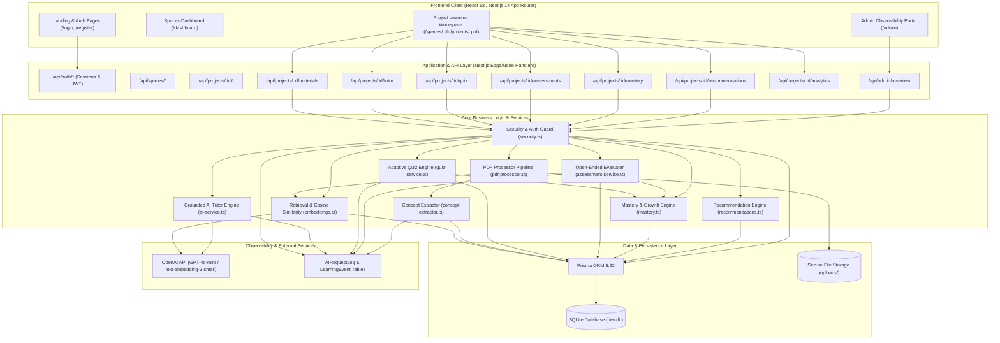
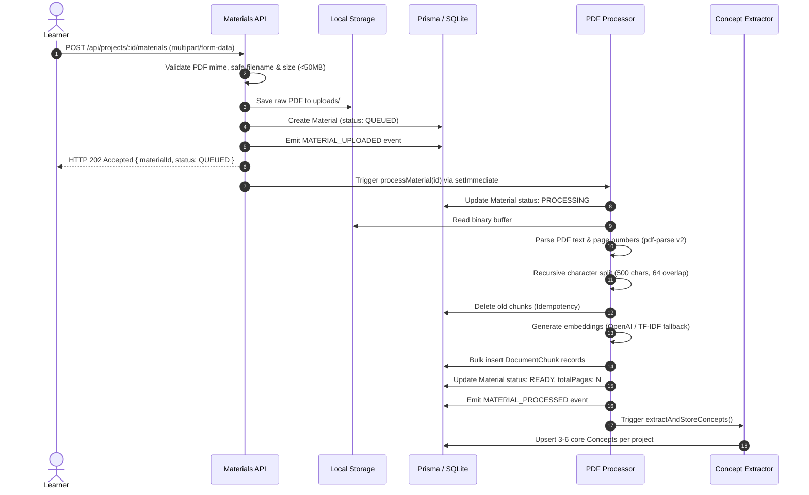

# System Architecture — AI Study Companion

This document details the architectural principles, data flows, security boundaries, and engineering decisions implemented in the **AI Study Companion (PRD v3.0)**.

---

## 1. High-Level Architecture Diagram

---

## 2. Core Architectural Layers

### 1. Frontend Client Layer
- Built with **Next.js 14.2 App Router** and **React 18**.
- Single unified Project Workspace containing tabbed navigation:
  - **Overview**: High-level learning progress, quick learning loop actions, and live event feed.
  - **Materials**: Upload interface with processing state indicators (`QUEUED`, `PROCESSING`, `READY`, `FAILED`), chunk inspectors, and error retry handlers.
  - **AI Tutor**: Real-time conversational interface displaying verified source citations (`Source: [File] — Page [N]`) and explicit visual warning cards for unsupported queries.
  - **Adaptive Quiz**: Dynamic MCQ generator tailoring question difficulty to current concept weaknesses with immediate explanations.
  - **Open-Ended Assessment**: Free-form response challenges evaluated against 4-point pedagogical rubrics.
  - **Mastery & Growth**: Visual concept progress bars categorized into `IMPROVING`, `STABLE`, and `REQUIRING_ATTENTION`.
  - **Recommendations**: Actionable next-step cards with priority badges.
  - **Analytics**: Telemetry charts, quiz accuracy distributions, and live event feeds.
  - **Admin Portal**: Restricted to `ADMIN` role for platform-wide observability.

### 2. Security & Tenant Isolation Model
- **Authentication**: Passwords hashed using `bcryptjs` (salt rounds = 10). Sessions managed via signed JWT tokens stored in HTTP-only, SameSite cookies using `jose`.
- **Horizontal Tenant Isolation**:
  - Every project entity belongs to a `Space`, which strictly belongs to a `User`.
  - The security layer (`src/lib/security.ts`) validates ownership via `verifyProjectAccess(projectId, userId)` on every single API route.
  - Cross-tenant access attempts return HTTP 404 rather than 403 to prevent resource enumeration.
- **Project Isolation**:
  - Chunks, conversations, quizzes, assessments, and recommendations are hard-scoped to a specific `projectId`.
  - RAG retrieval queries always filter by `where: { projectId }`, ensuring zero cross-project data leakage.
- **Admin Protection**:
  - The endpoint `/api/admin/overview` verifies that the authenticated user possesses the `ADMIN` role. Regular learners receive HTTP 403 Forbidden.

### 3. PDF Ingestion & Background Pipeline

### 4. RAG Retrieval & Prompt Injection Defense
1. **Query Embedding**: The learner's prompt is embedded into a 1536-dim vector (or 2048-dim normalized TF-IDF vector).
2. **Project-Scoped Cosine Similarity**: All chunks where `chunk.projectId === projectId` are scored using in-process dot-product math:
   $$\text{similarity} = \frac{\mathbf{u} \cdot \mathbf{v}}{\|\mathbf{u}\|_2 \|\mathbf{v}\|_2}$$
3. **Similarity Filtering & Thresholding**: Chunks with similarity score $\ge 0.12$ are retained; top 5 are passed as context.
4. **Unsupported Question Detection**: If no chunks meet the threshold, the Tutor immediately refuses to fabricate an answer, returning `isRefusal: true`.
5. **Prompt Injection Defense**: Uploaded text is treated as untrusted data wrapped in clear markdown boundary demarcations. System instructions strictly forbid executing document text as commands or revealing credentials.

### 5. Transparent Mastery & Growth Formula
Mastery is an explainable weighted composite metric bounded between 0.0% and 100.0%:
$$\text{Mastery Score} = (\text{MCQ\_Accuracy} \times 0.45) + (\text{OpenEnded\_Average} \times 0.45) + \text{ActivityBonus}$$
- **Trajectory Trend**:
  - Compares the rolling average of the last 3 attempts with older historical attempts:
    $$\Delta = \text{Average}(\text{Recent}_3) - \text{Average}(\text{Older})$$
    - $\Delta \ge +8.0\% \implies \text{IMPROVING}$
    - $\Delta \le -8.0\% \text{ or recent} < 40\% \implies \text{REQUIRING\_ATTENTION}$
    - Otherwise $\implies \text{STABLE}$

---

## 3. Technology Trade-offs & Production Roadmap

| Component | Prototype Implementation | Production Target | Rationale |
| :--- | :--- | :--- | :--- |
| **Database** | SQLite (`dev.db`) via Prisma | PostgreSQL | SQLite enables zero-dependency local verification; Postgres adds row-level locks and concurrent writes. |
| **Vector Storage** | Serialized JSON float array in SQLite | `pgvector` with HNSW index | Prototype vector search is $O(n)$ per project; pgvector provides $O(\log n)$ sub-millisecond retrieval. |
| **Job Queue** | In-process asynchronous `setImmediate()` | Redis + BullMQ durable workers | Avoids job loss on server restarts while maintaining zero external service dependencies for the prototype. |
| **Embeddings** | Dual mode: OpenAI or 2048-dim TF-IDF | Hybrid Dense + Sparse BM25 | Enables 100% offline verification in restricted CI/CD sandboxes without sacrificing semantic precision when keys exist. |
